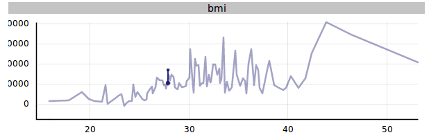
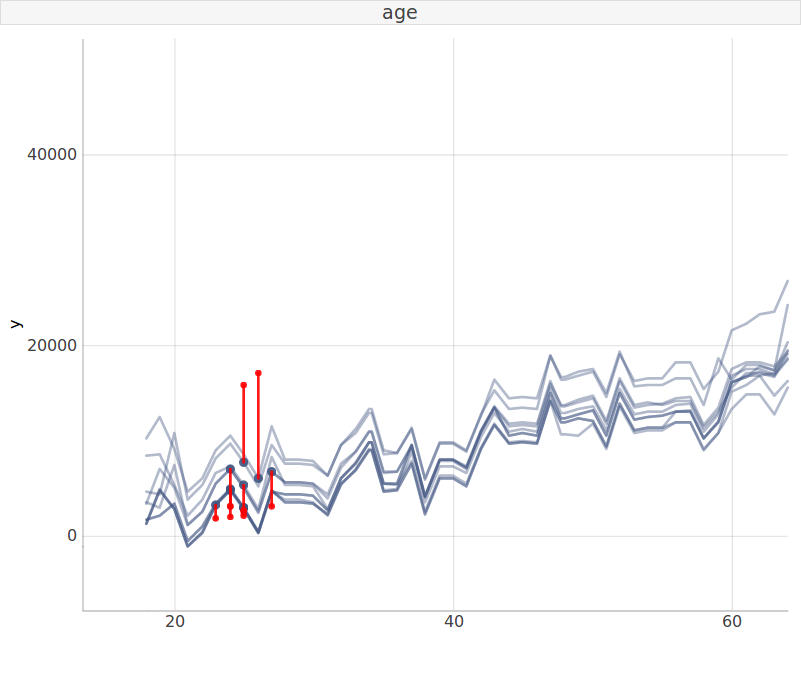
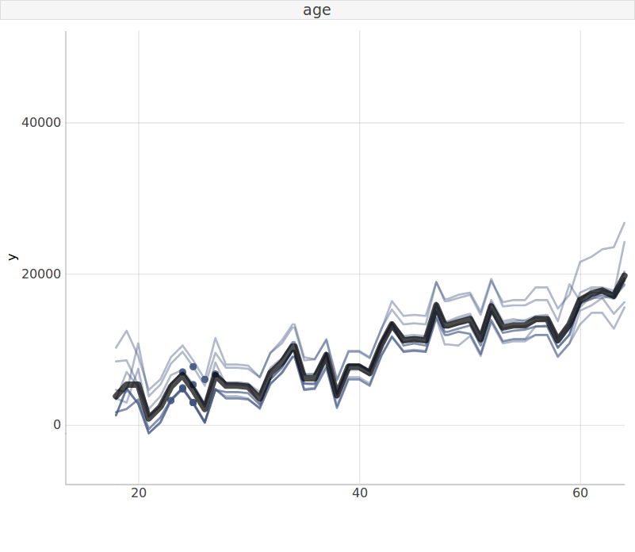
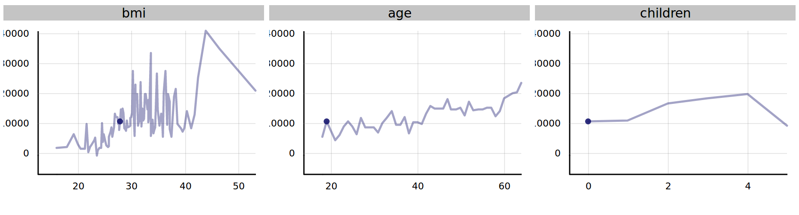
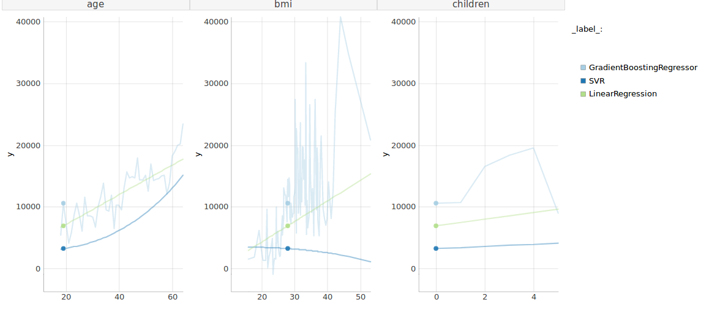
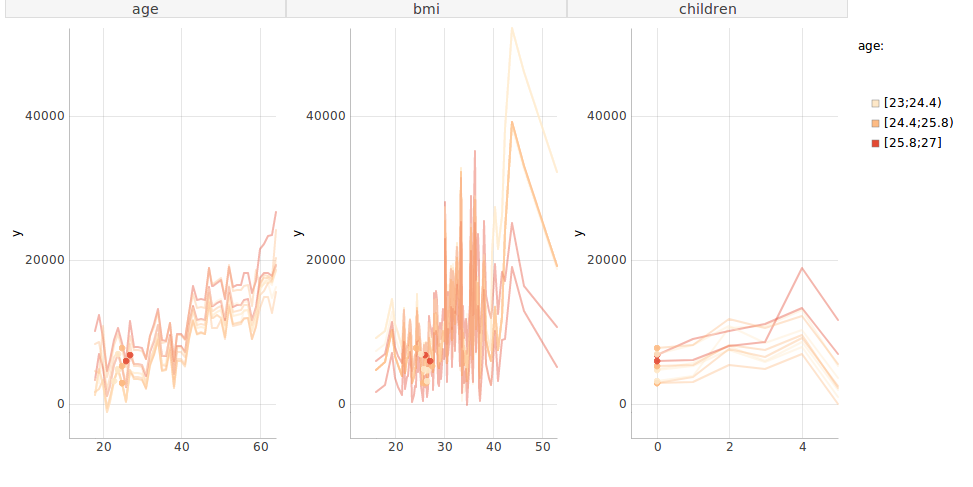

[](https://travis-ci.org/ModelOriented/pyCeterisParibus)
[](https://codecov.io/gh/ModelOriented/pyCeterisParibus)
[](https://pyceterisparibus.readthedocs.io/en/latest/?badge=latest)

# pyCeterisParibus
Python library for Ceteris Paribus Plots. See original R package: https://github.com/pbiecek/ceterisParibus

## Setup
Tested on Python 3.5+

PyCeterisParibus is on [PyPI](https://pypi.org/project/pyCeterisParibus/). Simply run:

```sh
pip install pyCeterisParibus
```
or install the newest version from GitHub by executing:
```
pip install git+https://github.com/ModelOriented/pyCeterisParibus
```
or download the sources, enter the main directory and perform:
```
https://github.com/ModelOriented/pyCeterisParibus.git
cd pyCeterisParibus
python setup.py install   # (alternatively use pip install .)
```

## Docs
Latest documentation is hosted here: 

https://pyceterisparibus.readthedocs.io

To build the documentation locally:
```
cd docs
make html
```
and open `_build/html/index.html`


## How to use Ceteris Paribus profiles?

### Prepare data
```
df = pd.read_csv('../datasets/insurance.csv')
df = df[['age', 'bmi', 'children', 'charges']]
x = df.drop(['charges'], inplace=False, axis=1)
y = df['charges']
var_names = list(x.columns)
x = x.values
y = y.values
```

### Train models
```
def linear_regression_model():
    linear_model = LinearRegression()
    linear_model.fit(x, y)
    # model, data, labels, variable_names
    return linear_model, x, y, var_names

def gradient_boosting_model():
    gb_model = ensemble.GradientBoostingRegressor(n_estimators=1000, random_state=42)
    gb_model.fit(x, y)
    return gb_model, x, y, var_names

def supported_vector_machines_model():
    svm_model = svm.SVR(C=0.01, gamma='scale', kernel='poly')
    svm_model.fit(x, y)
    return svm_model, x, y, var_names
```

### Wrap models into explainers objects
```
(linear_model, data, labels, variable_names) = linear_regression_model()
(gb_model, _, _, _) = gradient_boosting_model()
(svm_model, _, _, _) = supported_vector_machines_model()

explainer_linear = explain(linear_model, variable_names, data, y)
explainer_gb = explain(gb_model, variable_names, data, y)
explainer_svm = explain(svm_model, variable_names, data, y)
```

### Single variable response

```
from ceteris_paribus.profiles import individual_variable_profile
from ceteris_paribus.plots.plots import plot_d3

cp = individual_variable_profile(explainer_gb, x[0], y[0], variables={'bmi'})
plot(cp, show_residuals=True)
```



### Local fit

```
from ceteris_paribus.select_data import select_neighbours

neighbours_x, neighbours_y = select_neighbours(x, x[0], y=y, n=15)
cp_2 = individual_variable_profile(explainer_gb,
        neighbours_x, neighbours_y)
plot(cp_2, show_residuals=True, selected_variables=["bmi"])
```



### Average response

```
plot(cp_2, aggregate_profiles="mean", selected_variables=["age"])
```



### Many variables

```
plot(cp_1, selected_variables=["bmi", "age", "children"])
```



### Many models
```
cp_svm = individual_variable_profile(explainer_svm, x[0], y[0])
cp_linear = individual_variable_profile(explainer_linear, x[0], y[0])
plot(cp_1, cp_svm, cp_linear)
```


### Model interactions
```
plot(cp_2, color="bmi")
```


### Multiclass models (classification problem)
Prepare dataset and model
```
iris = load_iris()

def random_forest_classifier():
    rf_model = ensemble.RandomForestClassifier(n_estimators=100, random_state=42)
    rf_model.fit(iris['data'], iris['target'])
    return rf_model, iris['data'], iris['target'], iris['feature_names']
```

Wrap model into explainers
```
rf_model, iris_x, iris_y, iris_var_names = random_forest_classifier()

explainer_rf1 = explain(rf_model, iris_var_names, iris_x, iris_y,
                       predict_function= lambda X: rf_model.predict_proba(X)[::, 0], label=iris.target_names[0])
explainer_rf2 = explain(rf_model, iris_var_names, iris_x, iris_y,
                       predict_function= lambda X: rf_model.predict_proba(X)[::, 1], label=iris.target_names[1])
explainer_rf3 = explain(rf_model, iris_var_names, iris_x, iris_y,
                       predict_function= lambda X: rf_model.predict_proba(X)[::, 2], label=iris.target_names[2])
```

Calculate profiles and plot
```
cp_rf1 = individual_variable_profile(explainer_rf1, iris_x[0], iris_y[0])
cp_rf2 = individual_variable_profile(explainer_rf2, iris_x[0], iris_y[0])
cp_rf3 = individual_variable_profile(explainer_rf3, iris_x[0], iris_y[0])

plot(cp_rf1, cp_rf2, cp_rf3, selected_variables=['petal length (cm)', 'petal width (cm)', 'sepal length (cm)'])
```


## Acknowledgments
Work on this package was financially supported by the ‘NCN Opus grant 2016/21/B/ST6/0217’.
