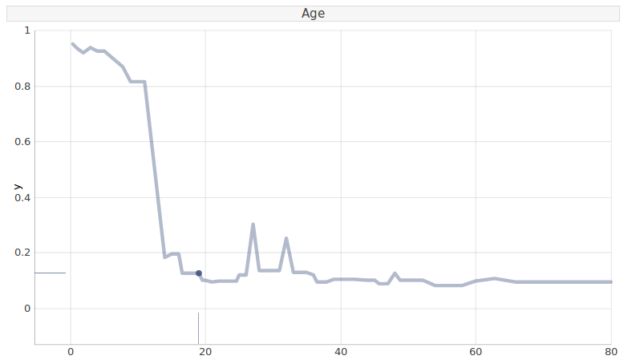
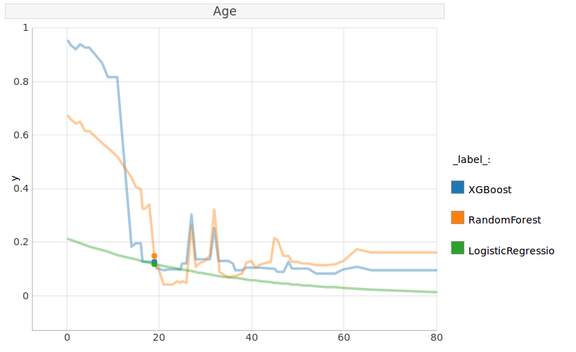
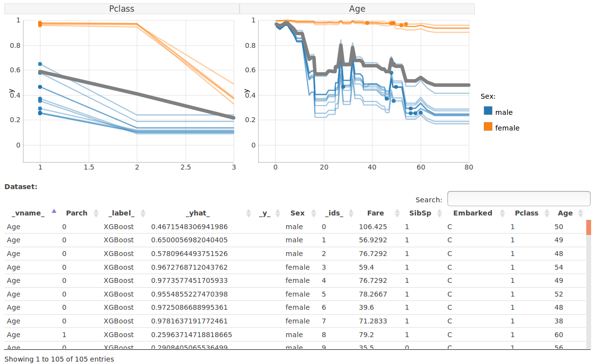
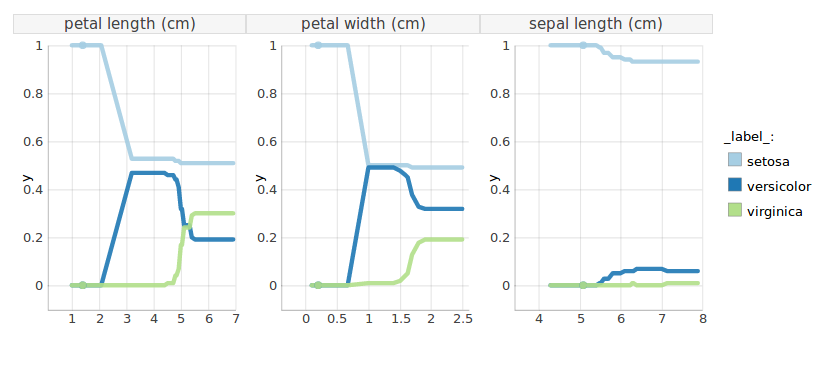

[](https://travis-ci.org/ModelOriented/pyCeterisParibus)
[](https://codecov.io/gh/ModelOriented/pyCeterisParibus)
[](https://pyceterisparibus.readthedocs.io/en/latest/?badge=latest)
[](https://pepy.tech/project/pyceterisparibus)
[](https://badge.fury.io/py/pyCeterisParibus)

# pyCeterisParibus
pyCeterisParibus is a Python library based on an *R* package [CeterisParibus](https://github.com/pbiecek/ceterisParibus).
It implements Ceteris Paribus Plots.
They allow understanding how the model response would change if a selected variable is changed. 
It’s a perfect tool for What-If scenarios. Ceteris Paribus is a Latin phrase meaning all else unchanged. 
These plots present the change in model response as the values of one feature change with all others being fixed. 
Ceteris Paribus method is model-agnostic - it works for any Machine Learning model.
The idea is an extension of PDP (Partial Dependency Plots) and ICE (Individual Conditional Expectations) plots.
It allows explaining single observations for multiple variables at the same time.
The plot engine is developed [here](https://github.com/MI2DataLab/ceterisParibusExt).

## Why is it so useful?
There might be several motivations behind utilizing this idea. 
Imagine a person gets a low credit score. 
The client wants to understand how to increase the score and the scoring institution (e.g. a bank) should be able to answer such questions. 
Moreover, this method is useful for researchers and developers to analyze, debug, explain and improve Machine Learning models, assisting the entire process of the model design.

## Setup
Tested on Python 3.5+

PyCeterisParibus is on [PyPI](https://pypi.org/project/pyCeterisParibus/). Simply run:

```bash
pip install pyCeterisParibus
```
or install the newest version from GitHub by executing:
```bash
pip install git+https://github.com/ModelOriented/pyCeterisParibus
```
or download the sources, enter the main directory and perform:
```bash
https://github.com/ModelOriented/pyCeterisParibus.git
cd pyCeterisParibus
python setup.py install   # (alternatively use pip install .)
```

## Docs
A detailed description of all methods and their parameters might be found in [documentation](https://pyceterisparibus.readthedocs.io/en/latest/ceteris_paribus.html).

To build the documentation locally:
```bash
cd docs
make html
```
and open `_build/html/index.html`

## Examples
Below we present use cases on two well-known datasets - Titanic and Iris. More examples e.g. for regression problems might be found [here](examples).

## Use case - Titanic survival
We demonstrate Ceteris Paribus Plots using the well-known Titanic dataset. In this problem, we examine the chance of survival for Titanic passengers.
We start with preprocessing the data and creating an XGBoost model.
```python
import pandas as pd
df = pd.read_csv('titanic_train.csv')

y = df['Survived']
x = df.drop(['Survived', 'PassengerId', 'Name', 'Cabin', 'Ticket'],
    inplace=False, axis=1)
    
valid = x['Age'].isnull() | x['Embarked'].isnull()
x = x[-valid]
y = y[-valid]

from sklearn.model_selection import train_test_split
X_train, X_test, y_train, y_test = train_test_split(x, y,
    test_size=0.2, random_state=42)
```
```python
from sklearn.pipeline import Pipeline
from sklearn.preprocessing import StandardScaler, OneHotEncoder
from sklearn.compose import ColumnTransformer

# We create the preprocessing pipelines for both numeric and categorical data.
numeric_features = ['Pclass', 'Age', 'SibSp', 'Parch', 'Fare']
numeric_transformer = Pipeline(steps=[
    ('scaler', StandardScaler())])

categorical_features = ['Embarked', 'Sex']
categorical_transformer = Pipeline(steps=[
    ('onehot', OneHotEncoder(handle_unknown='ignore'))])

preprocessor = ColumnTransformer(
    transformers=[
        ('num', numeric_transformer, numeric_features),
        ('cat', categorical_transformer, categorical_features)])
```

```python
xgb_clf = Pipeline(steps=[('preprocessor', preprocessor),
('classifier', XGBClassifier())])
xgb_clf.fit(X_train, y_train)
```

The model is wrapped into the unified form.
```python
from ceteris_paribus.explainer import explain
explainer_xgb = explain(xgb_clf, data=x, y=y, label='XGBoost',
    predict_function=lambda X: xgb_clf.predict_proba(X)[::, 1])
```


### Single variable profile
Let's look at Mr Ernest James Crease, the 19-year-old man, travelling on the 3. class from Southampton with an 8 pounds ticket in his pocket. He died on Titanic. Most likely, this would not have been the case had Ernest been a few years younger.
This plot presents the chance of survival for a person like Ernest at different ages. We can see things were tough for people like him unless they were a child.

```python
ernest = X_test.iloc[10]
label_ernest = y_test.iloc[10]
from ceteris_paribus.profiles import individual_variable_profile
cp_xgb = individual_variable_profile(explainer_xgb, ernest, label_ernest)
```

Having calculated the profile we can plot it. Note, that `plot_notebook` might be used instead of `plot` when used in Jupyter notebooks.

```python
from ceteris_paribus.plots.plots import plot
plot(cp_xgb, selected_variables=["Age"])
```



### Many models
The above picture explains the prediction of XGBoost model. What if we compare various models?

```python
rf_clf = Pipeline(steps=[('preprocessor', preprocessor),
    ('classifier', RandomForestClassifier())])
linear_clf = Pipeline(steps=[('preprocessor', preprocessor),
    ('classifier', LogisticRegression())])
    
rf_clf.fit(X_train, y_train)
linear_clf.fit(X_train, y_train)

explainer_rf = explain(rf_clf, data=x, y=y, label='RandomForest',
    predict_function=lambda X: rf_clf.predict_proba(X)[::, 1])
explainer_linear = explain(linear_clf, data=x, y=y, label='LogisticRegression', 
    predict_function=lambda X: linear_clf.predict_proba(X)[::, 1])
    
plot(cp_xgb, cp_rf, cp_linear, selected_variables=["Age"])
```



Clearly, XGBoost offers a better fit than Logistic Regression and is less overfitted than a Random Forest model.

### Many variables
This time we have a look at Miss. Elizabeth Mussey Eustis. She is 54 years old, travels at 1. class with her sister Marta, as they return to the US from their tour of southern Europe. They both survived the disaster.

```python
elizabeth = X_test.iloc[1]
label_elizabeth = y_test.iloc[1]
cp_xgb_2 = individual_variable_profile(explainer_xgb, elizabeth, label_elizabeth)
```

```python
plot(cp_xgb_2, selected_variables=["Pclass", "Sex", "Age", "Embarked"])
```


Would she have returned home if she had travelled at 3. class or if she had been a man? As we can observe this is less likely. On the other hand, for a first class, female passenger chances of survival were high regardless of age. Note, this was different in the case of Ernest. Place of embarkment (Cherbourg) has no influence, which is expected behaviour.

### Feature interactions and average response
Now, what if we look at passengers most similar to Miss. Eustis (middle-aged, upper class)?

```python
from ceteris_paribus.select_data import select_neighbours
neighbours = select_neighbours(X_train, elizabeth, 
    selected_variables=['Pclass', 'Age', 'SibSp', 'Parch', 'Fare', 'Embarked'], 
    n=15)
cp_xgb_ns = individual_variable_profile(explainer_xgb, neighbours)
```

```python
plot(cp_xgb_ns, color="Sex", selected_variables=["Pclass", "Age"], 
    aggregate_profiles='mean', size_pdps=6, alpha_pdps=1, size=2)
```

Plot function comes with extensive customization options. List of all parameters might be found in the [documentation](https://pyceterisparibus.readthedocs.io/en/latest/ceteris_paribus.plots.html).



There are two distinct clusters of passengers determined with their gender. Therefore a *PDP* average plot (on grey) does not show the whole picture. Children of both genders were likely to survive, but then we see a large gap. Also, being female increased the chance of survival mostly for second and first class passengers.

Additionally, one can interact with the plot by hovering over a point of interest to see more details. Similarly, there is an interactive table with options for highlighting relevant elements as well as filtering and sorting rows.


### Multiclass models - Iris dataset
Prepare dataset and model
```
iris = load_iris()

def random_forest_classifier():
    rf_model = ensemble.RandomForestClassifier(n_estimators=100, random_state=42)
    rf_model.fit(iris['data'], iris['target'])
    return rf_model, iris['data'], iris['target'], iris['feature_names']
```

Wrap model into explainers
```
rf_model, iris_x, iris_y, iris_var_names = random_forest_classifier()

explainer_rf1 = explain(rf_model, iris_var_names, iris_x, iris_y,
                       predict_function= lambda X: rf_model.predict_proba(X)[::, 0], label=iris.target_names[0])
explainer_rf2 = explain(rf_model, iris_var_names, iris_x, iris_y,
                       predict_function= lambda X: rf_model.predict_proba(X)[::, 1], label=iris.target_names[1])
explainer_rf3 = explain(rf_model, iris_var_names, iris_x, iris_y,
                       predict_function= lambda X: rf_model.predict_proba(X)[::, 2], label=iris.target_names[2])
```

Calculate profiles and plot
```
cp_rf1 = individual_variable_profile(explainer_rf1, iris_x[0], iris_y[0])
cp_rf2 = individual_variable_profile(explainer_rf2, iris_x[0], iris_y[0])
cp_rf3 = individual_variable_profile(explainer_rf3, iris_x[0], iris_y[0])

plot(cp_rf1, cp_rf2, cp_rf3, selected_variables=['petal length (cm)', 'petal width (cm)', 'sepal length (cm)'])
```


## Contributing
You're more than welcomed to contribute to this package. See the [guideline](CONTRIBUTING.md).

## Acknowledgments
Work on this package was financially supported by the ‘NCN Opus grant 2016/21/B/ST6/0217’.
