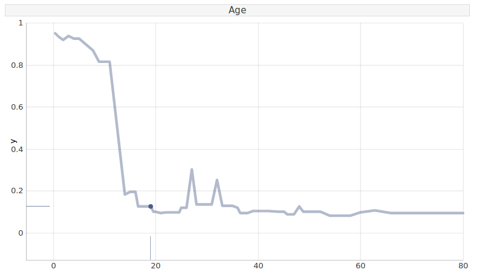
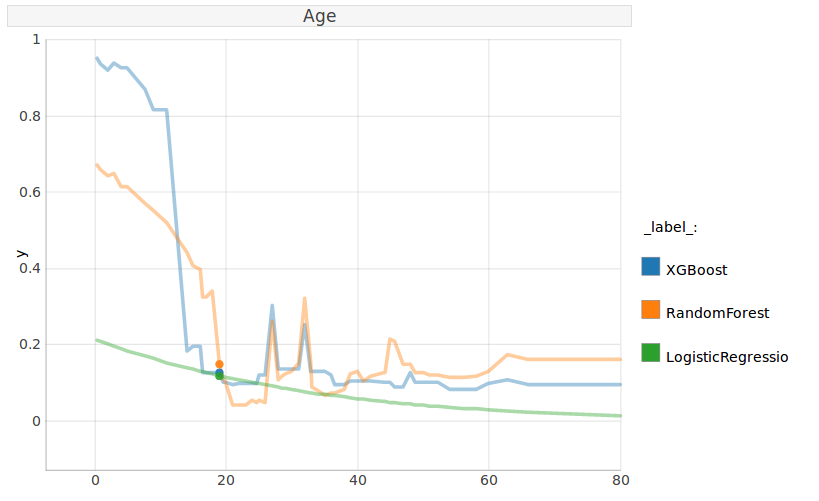
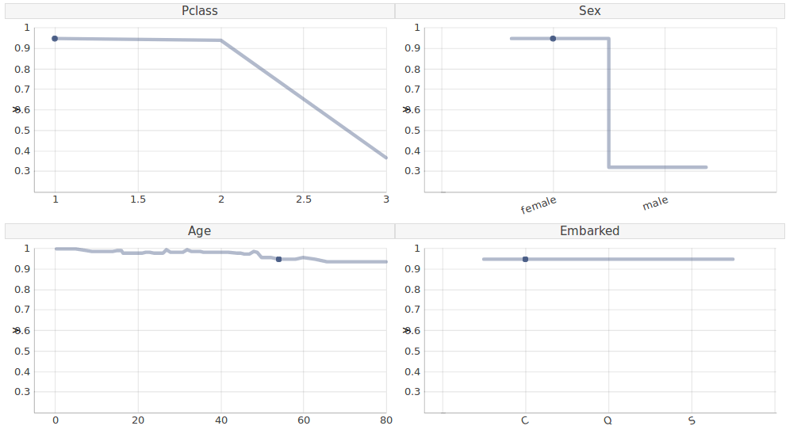
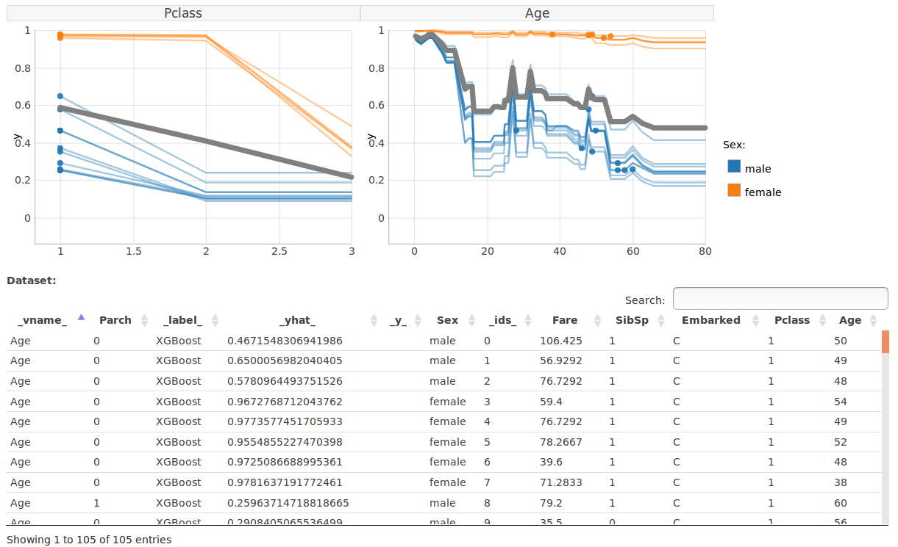

# Introduction

Machine learning is needed and used everywhere. It has fundamentally changed all data-driven disciplines, like health-care, biology, finance, legal, military, security, transportation, and many others. The increasing availability of large annotated data sources combined with recent developments in Machine Learning revolutionizes many disciplines. However, predictive models become more and more complex. It is not uncommon to have ensembles of predictive models with thousands or millions of parameters. Such models act as blackboxes. It is almost impossible for a human to understand reasons for model decisions.

This lack of interpretability often leads to harmful situations. Models are not working properly or are hard to debug, results are biased in a systematic way, data drift leads to the deterioration in models performance, the model is wrong but no-one can explain what caused a wrong prediction. Many examples for these problems are listed in the *Weapons of Math Destruction*, a bestseller with an expressive subtitle *How Big Data Increases Inequality and Threatens Democracy* [@ONeil]. Reactions for some of these problems are new legal regulations, like the *General Data Protection Regulation and the Right to Explanation* [@RightToExpl3].

New tools are being created to support model interpretability. The most known methods are Local Interpretable Model-agnostic Explanations (LIME) [@LIME], SHapley Additive exPlanations (SHAP) [@SHAP] and Descriptive mAchine Learning EXplanations (DALEX) [@DALEX]. General purpose libraries for interpretable Machine Learning in Python are skater [@pramit_choudhary_2018_1198885] and [ELI5](https://eli5.readthedocs.io/en/latest/).

An interesting alternative to these tools is the methodology of *Ceteris Paribus Profiles* and their averages called *Partial Dependency Plots*. They enable to understand how the model response would change if a selected variable is changed. It's a perfect tool for What-If scenarios. _Ceteris Paribus_ is a Latin phrase meaning _all else unchanged_. These plots present the change in model response as the values of one feature change with all others being fixed. Ceteris Paribus method is model-agnostic - it works for any Machine Learning model.
The idea is an extension of *PDP* (Partial Dependency Plots) [@friedman2001] and *ICE* (Individual Conditional Expectations) plots [@GoldsteinICE]. It allows explaining single observations for multiple variables at the same time.

In this paper, we introduce a `pyCeterisParibus` library for Python that supports a wide range of tools built on Ceteris Paribus Profiles. There might be several motivations behind utilizing this idea. Imagine a person gets a low credit score. The client wants to understand how to increase the score and the scoring institution (e.g., a bank) should be able to answer such questions. Moreover, this method is useful for researchers and developers to analyze, debug, explain and improve Machine Learning models, assisting the entire process of the model design. The more detailed demonstration is available in the *Examples* section.


# pyCeterisParibus library
`pyCeterisParibus` is a Python [library](https://github.com/ModelOriented/pyCeterisParibus) based on an *R* package *CeterisParibus* [@CeterisParibus]. It is an open source software released on the Apache license.

The workflow consists of three steps:

*    wrapping models into a unified representation
*    calculating profiles for given observations, variables and models
*    plotting the profiles

Plots are drawn using a separate *D3.js* [library](https://github.com/ModelOriented/ceterisParibusD3) which produces interactive Ceteris Paribus plots for both *Python* (this package) and [*R*](https://github.com/flaminka/ceterisParibusD3) implementations.
This package allows explaining multiple observations and observing local behaviours of the model. For this purpose, methods for sampling and selecting neighbouring observations are implemented along with the *Gower's distance [@gower]* function. 
A more detailed description might be found in the package [documentation](https://pyceterisparibus.readthedocs.io/).

# Examples
We demonstrate Ceteris Paribus Plots using the well-known Titanic dataset. In this problem, we examine the chance of survival for Titanic passengers.
We start with preprocessing the data and creating an XGBoost model.
```python
import pandas as pd
df = pd.read_csv('titanic_train.csv')

y = df['Survived']
x = df.drop(['Survived', 'PassengerId', 'Name', 'Cabin', 'Ticket'],
    inplace=False, axis=1)
    
valid = x['Age'].isnull() | x['Embarked'].isnull()
x = x[-valid]
y = y[-valid]

from sklearn.model_selection import train_test_split
X_train, X_test, y_train, y_test = train_test_split(x, y,
    test_size=0.2, random_state=42)
```
```python
from sklearn.pipeline import Pipeline
from sklearn.preprocessing import StandardScaler, OneHotEncoder
from sklearn.compose import ColumnTransformer

# We create the preprocessing pipelines for both numeric and categorical data.
numeric_features = ['Pclass', 'Age', 'SibSp', 'Parch', 'Fare']
numeric_transformer = Pipeline(steps=[
    ('scaler', StandardScaler())])

categorical_features = ['Embarked', 'Sex']
categorical_transformer = Pipeline(steps=[
    ('onehot', OneHotEncoder(handle_unknown='ignore'))])

preprocessor = ColumnTransformer(
    transformers=[
        ('num', numeric_transformer, numeric_features),
        ('cat', categorical_transformer, categorical_features)])
```

```python
from xgboost import XGBClassifier
xgb_clf = Pipeline(steps=[('preprocessor', preprocessor),
('classifier', XGBClassifier())])
xgb_clf.fit(X_train, y_train)
```

Here the pyCeterisParibus starts. Since this library works in a model agnostic fashion, first we need to create a wrapper around the model with uniform predict interface.
```python
from ceteris_paribus.explainer import explain
explainer_xgb = explain(xgb_clf, data=x, y=y, label='XGBoost',
    predict_function=lambda X: xgb_clf.predict_proba(X)[::, 1])
```


### Single variable profile
Let's look at Mr Ernest James Crease, the 19-year-old man, travelling on the 3rd class from Southampton with an 8 pounds ticket in his pocket. He died on the Titanic. Most likely, this would not have been the case had Ernest been a few years younger.
Figure 1 presents the chance of survival for a person like Ernest at different ages. We can see things were tough for people like him unless they were a child.

```python
ernest = X_test.iloc[10]
label_ernest = y_test.iloc[10]
from ceteris_paribus.profiles import individual_variable_profile
cp_xgb = individual_variable_profile(explainer_xgb, ernest, label_ernest)
```

Having calculated the profile we can plot it. Note, that `plot_notebook` might be used instead of `plot` when used in Jupyter notebooks.

```python
from ceteris_paribus.plots.plots import plot
plot(cp_xgb, selected_variables=["Age"])
```



### Many models
The above picture explains the prediction of XGBoost model. What if we compare various models?

```python
from sklearn.ensemble import RandomForestClassifier
from sklearn.linear_model import LogisticRegression
rf_clf = Pipeline(steps=[('preprocessor', preprocessor),
    ('classifier', RandomForestClassifier())])
linear_clf = Pipeline(steps=[('preprocessor', preprocessor),
    ('classifier', LogisticRegression())])
    
rf_clf.fit(X_train, y_train)
linear_clf.fit(X_train, y_train)

explainer_rf = explain(rf_clf, data=x, y=y, label='RandomForest',
    predict_function=lambda X: rf_clf.predict_proba(X)[::, 1])
explainer_linear = explain(linear_clf, data=x, y=y, label='LogisticRegression', 
    predict_function=lambda X: linear_clf.predict_proba(X)[::, 1])
    
plot(cp_xgb, cp_rf, cp_linear, selected_variables=["Age"])
```



Clearly, XGBoost offers a better fit than Logistic Regression (Figure 2). 
Also, it predicts a higher chance of survival at child's age than the Random Forest model does.

### Profiles for many variables
This time we have a look at Miss. Elizabeth Mussey Eustis. She is 54 years old, travels at 1st class with her sister Marta, as they return to the US from their tour of southern Europe. They both survived the disaster.

```python
elizabeth = X_test.iloc[1]
label_elizabeth = y_test.iloc[1]
cp_xgb_2 = individual_variable_profile(explainer_xgb, elizabeth, label_elizabeth)
```

```python
plot(cp_xgb_2, selected_variables=["Pclass", "Sex", "Age", "Embarked"])
```



Would she have returned home if she had travelled at 3rd class or if she had been a man? As we can observe (Figure 3) this is less likely. On the other hand, for a first class, female passenger chances of survival were high regardless of age. Note, this was different in the case of Ernest. Place of embarkment (Cherbourg) has no influence, which is expected behaviour.

### Feature interactions and average response
Now, what if we look at passengers most similar to Miss. Eustis (middle-aged, upper class)?

```python
from ceteris_paribus.select_data import select_neighbours
neighbours = select_neighbours(X_train, elizabeth, 
    selected_variables=['Pclass', 'Age', 'SibSp', 'Parch', 'Fare', 'Embarked'], 
    n=15)
cp_xgb_ns = individual_variable_profile(explainer_xgb, neighbours)
```

```python
plot(cp_xgb_ns, color="Sex", selected_variables=["Pclass", "Age"], 
    aggregate_profiles='mean', size_pdps=6, alpha_pdps=1, size=2)
```



There are two distinct clusters of passengers determined with their gender (Figure 4), therefore a *PDP* average plot (on grey) does not show the whole picture. Children of both genders were likely to survive, but then we see a large gap. Also, being female increased the chance of survival mostly for second and first class passengers.

Plot function comes with extensive customization options. List of all parameters might be found in the documentation. Additionally, one can interact with the plot by hovering over a point of interest to see more details. Similarly, there is an interactive table with options for highlighting relevant elements as well as filtering and sorting rows.


# Acknowledgements

Michał Kuźba was financially supported by NCN Opus grant 2016/21/B/ST6/0217 , Ewa Baranowska was financially supported by NCN Opus grant 2017/27/B/ST6/01307.

# References
